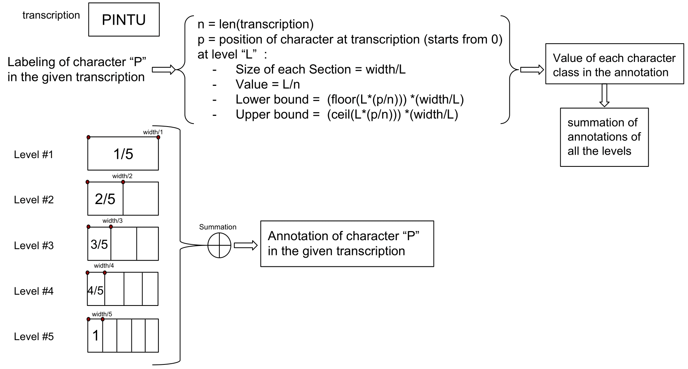
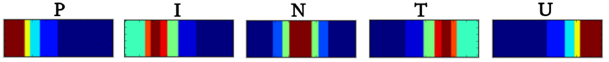
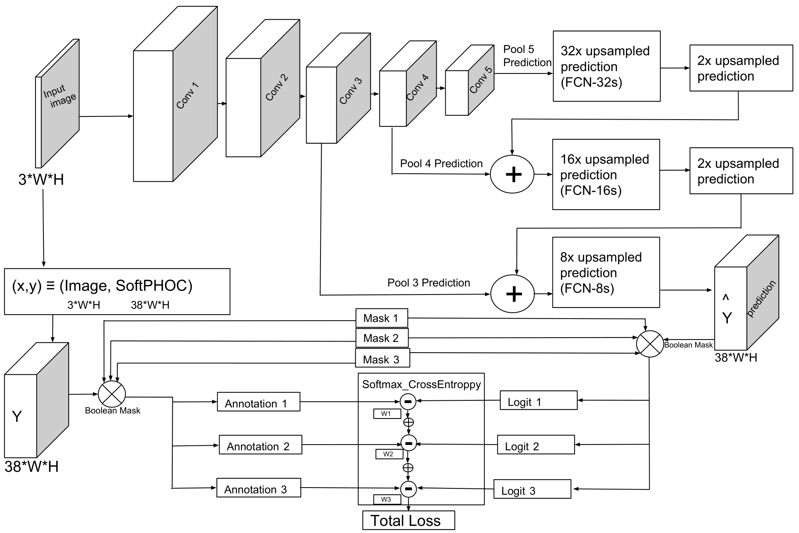

# SoftPHOC_TextDescriptor
Soft-PHOC is an intermediate representation of images based on character probability maps.

[This work](https://arxiv.org/pdf/1809.00854v2.pdf) has two implementations based on Pytorch and TensorFlow.

The SoftPhoc annotation.For instance, if the transcription is “PINTU”, we show how we can define the annotation of class “P” for
the given transcription based on the value at each level of soft-PHOC descriptor.


<p align="center">
  
</p>



A Deep Convolutional Neural Network estimating Soft-PHOC descriptors.


## Pytorch ##

The pytorch [implementation](https://github.com/denabazazian/SoftPHOC_TextDescriptor/tree/master/Pytorch) of SoftPHOC training.

### Installation ###

Find the environmet at: environment.yml
```
conda install python=3.6 ipython pytorch=0.4 torchvision opencv=3.4.4 tensorboardx mkl=2019 tensorboard tensorflow tqdm scikit-image
```
* Required packages:
    * Pytorch 0.4
    * OpenCV 3.4.4
    * mkl 2019
    * tqm
    * scikit-image
    * tensorboardX

### train ###

* For training ICDAR:
``` 
bash train_icdar.sh
```

* For training SynthText:
``` 
bash train_synthText.sh
```

## TensorFlow ##

The TensorFlow [implementation](https://github.com/denabazazian/SoftPHOC_TextDescriptor/tree/master/TensorFlow) of Soft-PHOC. 

* Required packages:
    * TensorFlow 1.10
    * OpenCV 3.4.4
    * mkl 2019
    * tqm
    * scikit-image
    * tensorboardX

* For training:
``` 
python fcn_32_train_generator_validation_summary.py
```

* Word spotting codes are in ``` word_spotting ``` to extract the query word. 

* For visualizing the character heatmaps the codes are in ``` visualize_hm```. 

# Citation #

Please cite [this work](https://arxiv.org/pdf/1809.00854v2.pdf) in your publications if it helps your research: <br />

@article{Bazazian18-softPHOC,<br />
&nbsp;&nbsp;&nbsp;&nbsp;&nbsp;&nbsp;	author = {D.~Bazazian and D.~Karatzas and A.~Bagdanov},<br />
&nbsp;&nbsp;&nbsp;&nbsp;&nbsp;&nbsp;	title = {Soft-PHOC Descriptor for End-to-End Word Spotting in Egocentric Scene Images},<br />
&nbsp;&nbsp;&nbsp;&nbsp;&nbsp;&nbsp;	journal = {EPIC workshop at European Conference on Computer Vision Workshop},<br />
&nbsp;&nbsp;&nbsp;&nbsp;&nbsp;&nbsp;	year = {2018},<br />
&nbsp;&nbsp;&nbsp;&nbsp;&nbsp;&nbsp;        ee = {arxiv.org/pdf/1809.00854.pdf}<br />
}<br />
